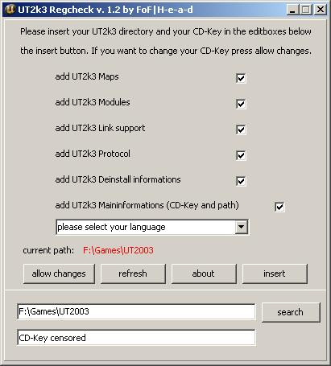

## UT2kx Reg check

Version: 1.0  
Author: Head  
Operating systems: WIN 95/98/ME/2K/XP/LH

Thank you for downloading my small registry check tool.

The major task of this tool is to add your CD-Key and UT2kx-path to the windows-registry (after a format c:, if you lost your registry or in other cases). Additional you are able to view/change your CD-Key and your UT2kx-path in a simple and easy way.

You can individually add UT2kx UMods, UT2kx links, UT2kx maps, unreal protocol or the UT2kx uninstall information in all languages which ut2kx supports to the registry.
It's now also possible to switch between the versions of UT, if you install UT2004 you won't be able to use the .ut2 files with UT2003 anymore.

Note: UT2kx RegCheck will only change the language of the error messages (for example if you have forgotten to insert your game disc) not the language of the game.

If you want to change the UT2kx-path and CD-Key (if you already installed UT2kx) simply click on "allow changes", make your changes and press insert.

---

---

## Changelog

Changelog 1.3 -> 1.0 (09. apr. 2004)

rename: the name of my tool is now UT2KxRegCheck
added: full UT2004 Support, you can use it like the UT2003 version
added: some eye-candy
added: new about box
fixed: a small bug with the searchbutton, which was inactive in some cases

Changelog 1.2 -> 1.3 (18. jan. 2003) -> final

fixed: the informations for ut2mods will now be inserted right, the ut2mod files
were erroneously redirected to the ut2003.exe. (thx to eXoR)

Changelog 1.1 -> 1.2 (30. nov. 2002)

added: exe compression from ~518 to ~223 kb (better compression than zip)
added: language-support, you are now able to set all languages (which UT2k3
supports) to the registry
added: error message if none or a wrong language was chosen
added: version info if you right-click the exe and chose properties
added: preview screenshot to the zip file
fixed: "maximize" button is now disabled
fixed: insert button shows "all data inserted" only if changes really have
happend
fixed: checkboxes will now be unchecked if you use the refresh button and if
the keys allready exsist

Changelog 1.0 -> 1.1 (28. nov. 2002)

added: the UT-path search button
added: the "allow changes" button for easy change of your cd-key
added: ability to view the CD-Key and UT2k3 path
added: stat "hidden" for checkboxes when regkey allready exsits
added: ability to resfresh registry keys if external actions changed them
fixed: spelling errors
fixed: adding regkey for maps/links/protocols/umods doesnt work right
fixed: the design .. looks better now imho
fixed: the border is not longer sizeable

Changelog -> 1.0 (26. nov. 2002)

everything

---

## License

MIT License

Copyright (c) 2020 Sebastian Gerske

Permission is hereby granted, free of charge, to any person obtaining a copy
of this software and associated documentation files (the "Software"), to deal
in the Software without restriction, including without limitation the rights
to use, copy, modify, merge, publish, distribute, sublicense, and/or sell
copies of the Software, and to permit persons to whom the Software is
furnished to do so, subject to the following conditions:

The above copyright notice and this permission notice shall be included in all
copies or substantial portions of the Software.

THE SOFTWARE IS PROVIDED "AS IS", WITHOUT WARRANTY OF ANY KIND, EXPRESS OR
IMPLIED, INCLUDING BUT NOT LIMITED TO THE WARRANTIES OF MERCHANTABILITY,
FITNESS FOR A PARTICULAR PURPOSE AND NONINFRINGEMENT. IN NO EVENT SHALL THE
AUTHORS OR COPYRIGHT HOLDERS BE LIABLE FOR ANY CLAIM, DAMAGES OR OTHER
LIABILITY, WHETHER IN AN ACTION OF CONTRACT, TORT OR OTHERWISE, ARISING FROM,
OUT OF OR IN CONNECTION WITH THE SOFTWARE OR THE USE OR OTHER DEALINGS IN THE
SOFTWARE.
